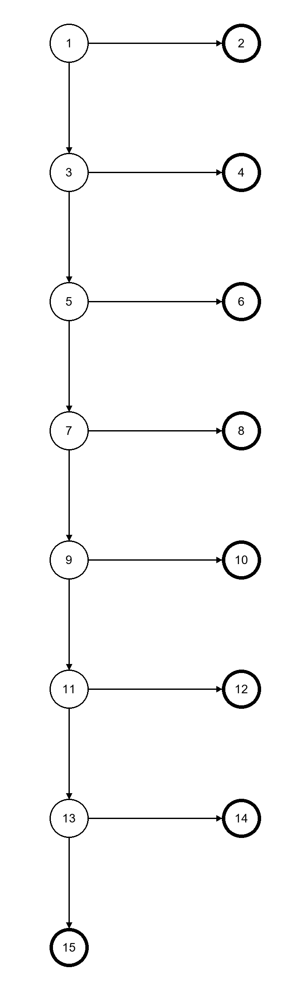
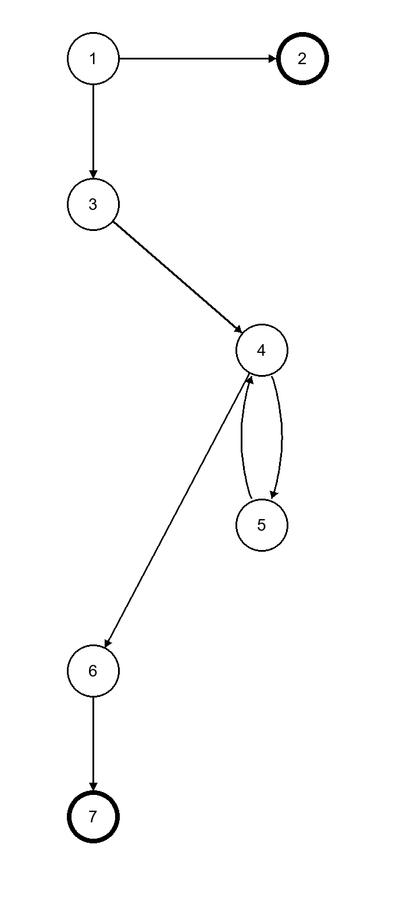
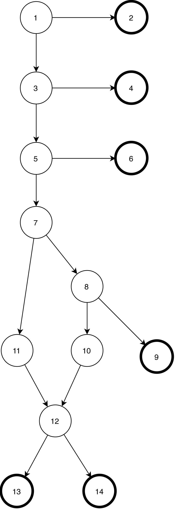
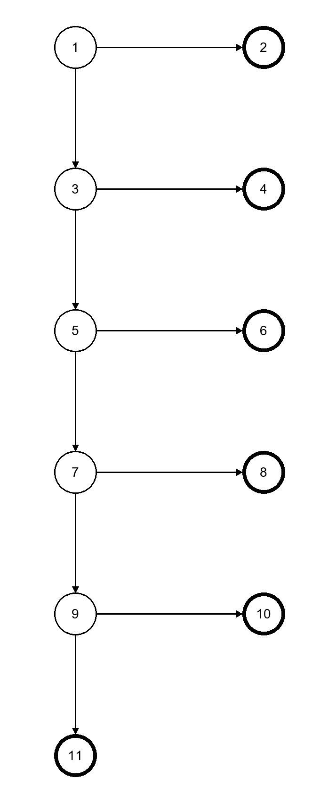
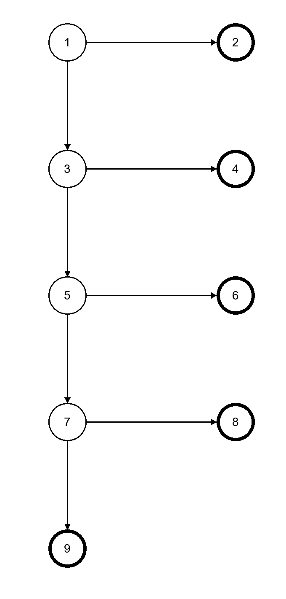
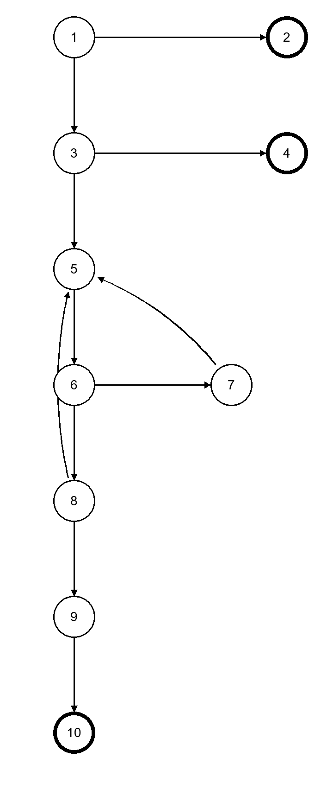
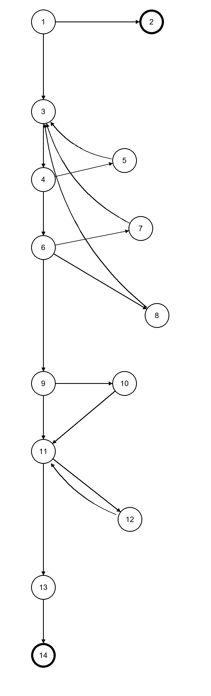
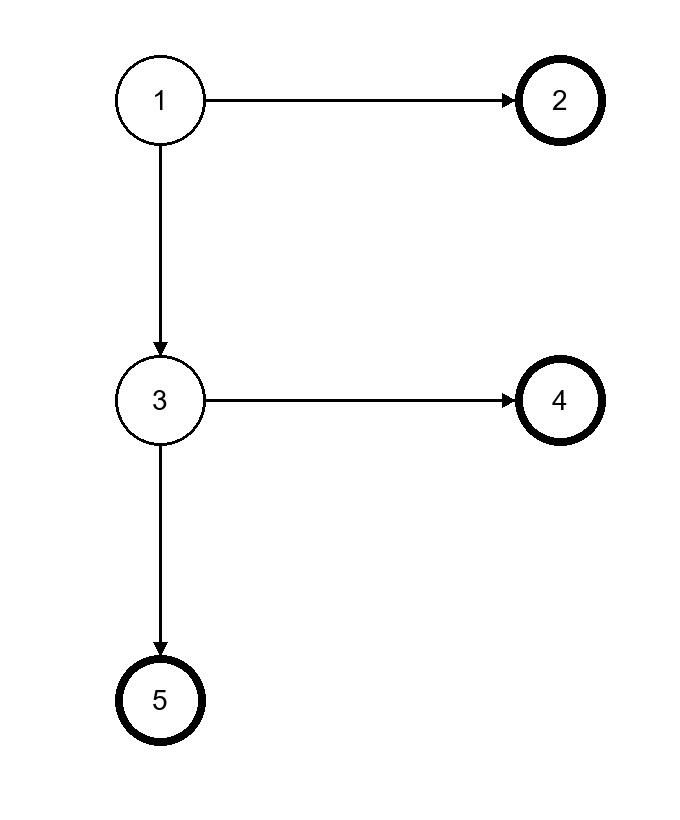
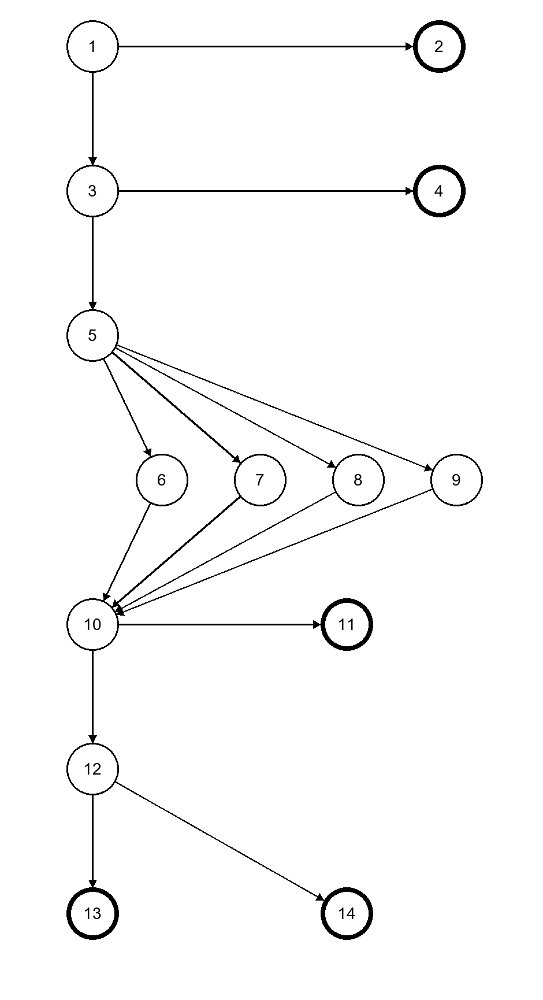

# Petify: Software Testing

This repository is for **testing** Petify, a full-stack platform for pet listings,
owners, reviews, favorites, and veterinary clinics.

**Veronika Ilioska** wrote Petify. This repository does not add product features.
It combines her backend and frontend in one monorepo and adds automated tests and
test-design documents for that software.

| | Original repository (by Veronika Ilioska) | Fork used here |
|---|---|---|
| Backend (Java, Spring Boot, PostgreSQL) | [veronika-ilioska/petify-backend](https://github.com/veronika-ilioska/petify-backend) | [h-gajdov/petify-backend](https://github.com/h-gajdov/petify-backend) |
| Frontend (Vue 3, Vite, TypeScript) | [veronika-ilioska/petify-frontend](https://github.com/veronika-ilioska/petify-frontend) | [h-gajdov/petify-frontend](https://github.com/h-gajdov/petify-frontend) |

Petify was built for the **Databases** course at FINKI
([project page](https://develop.finki.ukim.mk/projects/petify)).

## Repository layout

```text
.
├── backend/     Spring Boot API and its Java tests (from petify-backend)
├── frontend/    Vue 3 single-page app (from petify-frontend)
├── ui-tests/    Selenium UI tests (Python, pytest) that run both apps together
└── docs/        Test-design documents (graph, logic, ISP, and mutation coverage)
```

`frontend/` was added with `git subtree`, so its commit history is kept.

## Where to find the tests

### Backend tests (Java, JUnit 5, TestNG)

All backend tests are in [`backend/src/test/java/com/petify/petify`](backend/src/test/java/com/petify/petify).

| Kind | Location | Notes |
|---|---|---|
| Service unit tests | [`service/`](backend/src/test/java/com/petify/petify/service) | Service-layer tests for appointments, auth, favorites, health records, listings, pets, reviews, recommendations, analytics, and the maintenance scheduler |
| Logic coverage tests | [`AppointmentServiceLogicCoverageTest`](backend/src/test/java/com/petify/petify/service/AppointmentServiceLogicCoverageTest.java), [`ListingServiceLogicCoverageTest`](backend/src/test/java/com/petify/petify/service/ListingServiceLogicCoverageTest.java), [`ReviewServiceLogicCoverageTest`](backend/src/test/java/com/petify/petify/service/ReviewServiceLogicCoverageTest.java) | Parameterized tests that implement the cases in [`docs/logic_coverage.md`](docs/logic_coverage.md) |
| MockMvc API tests | [`api/ApiMvcTest.java`](backend/src/test/java/com/petify/petify/api/ApiMvcTest.java) | Real controllers, services, and security against a Testcontainers PostgreSQL database |
| End-to-end tests (TestNG) | [`e2e/PetifyE2EIT.java`](backend/src/test/java/com/petify/petify/e2e/PetifyE2EIT.java) | Starts the whole backend and calls it over HTTP; `-Pe2e` profile |
| Stress tests | [`stress/ApiStressTest.java`](backend/src/test/java/com/petify/petify/stress/ApiStressTest.java) | Concurrent load on public endpoints; `-Pstress` profile |
| Migration and context tests | [`PetifyApplicationTests`](backend/src/test/java/com/petify/petify/PetifyApplicationTests.java), [`ProductionMigrationsTest`](backend/src/test/java/com/petify/petify/ProductionMigrationsTest.java), [`config/FlywayConfigCompatibilityTest`](backend/src/test/java/com/petify/petify/config/FlywayConfigCompatibilityTest.java) | Application startup and Flyway migration checks |
| Test seed data | [`backend/src/test/resources/db/test-seed`](backend/src/test/resources/db/test-seed) | Sample accounts, clinics, listings, and health records loaded only in tests |

### UI tests (Selenium, pytest)

The UI tests are in [`ui-tests/`](ui-tests):

- [`ui-tests/tests/`](ui-tests/tests): test cases for login, signup, top navigation,
  listings, listing details, profiles, appointments, clinic dashboard, and admin pages
- [`ui-tests/pages/`](ui-tests/pages): Page Object Model classes used by the tests
- [`ui-tests/stack.py`](ui-tests/stack.py): starts PostgreSQL (Testcontainers), the
  backend, and the frontend for a test run
- [`ui-tests/video.py`](ui-tests/video.py): optional video recording of each test

### API collection (Postman)

[`backend/postman/Petify_Api_Test.postman_collection.json`](backend/postman/Petify_Api_Test.postman_collection.json)
contains a Postman collection for manual and automated API checks.

### Test-design documents

| Document | Contents |
|---|---|
| [`docs/graph_coverage.md`](docs/graph_coverage.md) | Control-flow graphs ([images](docs/test_assets)) and edge-pair and prime-path coverage requirements for service methods |
| [`docs/logic_coverage.md`](docs/logic_coverage.md) | Predicate, clause, active-clause, and combinatorial coverage of service-layer conditions |
| [`docs/isp.md`](docs/isp.md) | Input space partitioning (All Combinations and Base Choice coverage) |
| [`docs/mutation_coverage.md`](docs/mutation_coverage.md) | How to run PIT mutation testing |

## Running the tests

Requirements: Java 17, Docker (for Testcontainers), and, for UI tests, Node.js,
Python 3, and Chrome or Firefox.

Backend tests (run from `backend/`):

```bash
cd backend
./mvnw test                                                        # unit, MockMvc, and migration tests
./mvnw -Pe2e test-compile failsafe:integration-test failsafe:verify # TestNG end-to-end suite
./mvnw test -Pstress                                               # stress tests (needs a running backend)
./mvnw org.pitest:pitest-maven:mutationCoverage                    # mutation testing (PIT)
```

UI tests (run from the repository root):

```bash
(cd frontend && npm ci)
python -m venv ui-tests/.venv
ui-tests/.venv/bin/python -m pip install -r ui-tests/requirements.txt
ui-tests/.venv/bin/python -m pytest ui-tests                   # add --record-video to save mp4s
```

[`backend/README.md`](backend/README.md) has more detail on each suite, the
available options, and how to run the application itself.
[`frontend/README.md`](frontend/README.md) covers the frontend.

## Credits

**Application (backend and frontend):** [Veronika Ilioska](https://github.com/veronika-ilioska)

**Tests and test documentation:**

| Name | Index | GitHub |
|---|---|---|
| Kiril Veljanoski | 231028 | [KIRCA18](https://github.com/KIRCA18) |
| Veronika Ilioska | 231035 | [veronika-ilioska](https://github.com/veronika-ilioska) |
| Hristijan Gajdov | 231119 | [h-gajdov](https://github.com/h-gajdov) |

## Graph coverage images

Control-flow graphs used in [`docs/graph_coverage.md`](docs/graph_coverage.md).
The coverage requirements and test paths for each graph are in that document.

### Edge-pair coverage

#### `AppointmentService.cancelAppointmentForOwner`


#### `AuthService.login`


### Prime-path coverage

#### `AppointmentService.markAppointmentNoShowForClinicUser`


#### `HealthRecordService.createHealthRecord`



#### `AuthService.getAllUsers`


#### `HealthRecordService.getHealthRecordsForPet` (same graph as ListingService.getListingsByOwner)



#### `AuthService.signUp`


#### `ReviewService.createReview`



#### `ReviewService.createClinicReview`



#### `ReviewService.updateReview`



#### `ReviewService.deleteReview`


#### `ReviewService.getReviewsByUser`


#### `ListingService.updateListingStatus`


#### `AppointmentService.getAvailableSlots`



#### `AppointmentService.getAppointmentsForOwner`



#### `AppointmentService.notifyClinicAboutCancellation`



#### `PetService.savePetPhoto`



### All-DU-paths coverage

#### `AppointmentService.createUnavailableSlot`


#### `AuthService.mapToDTO`


